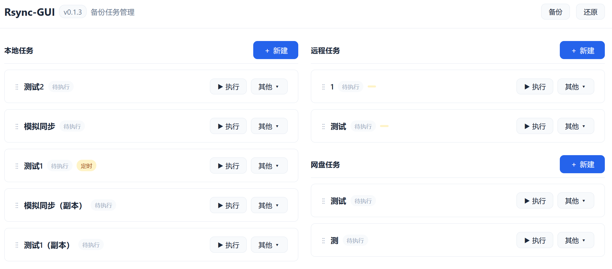

# Rsync-GUI

轻量级 Web 界面，管理 rsync 备份任务。

## 快速开始

```bash
# 1. 安装依赖
uv sync
# uv sync -U # 安装最新版依赖（可能出兼容性问题）

# 2. 启动
uv run main.py
```

浏览器访问 `http://127.0.0.1:9765`。

程序以当前用户权限运行。如需访问所有文件，建议以 root 启动。

## 使用 Docker

### 构建镜像

需先按下方「打包为单文件」生成 `dist/rsync-gui`。

```bash
docker build -t hansyou/rsync-gui:latest .
```

### 运行容器

在项目根目录新建 `docker-compose.yml`：

```yaml
services:
    rsync-gui:
        image: hansyou/rsync-gui:latest
        container_name: rsync-gui
        ports:
            - "9765:9765"
        # environment:
        # 以下均为默认值
        # - RSYNC_GUI_DATA=/app/data
        # - RCLONE_CONFIG=/app/data/rclone.conf
        # - XDG_CACHE_HOME=/app/data/.cache
        volumes:
            #  防止时区错误
            - /etc/localtime:/etc/localtime:ro
            - /etc/timezone:/etc/timezone:ro
            - ./data:/app/data
            # 复用主机 ssh 配置，可选
            # - /home/admin/.ssh:/root/.ssh:ro
            # 复用宿主机已有 rclone 配置，可选
            # - ./dist/rclone.conf:/app/data/rclone.conf
            # 待备份目录
            # - /host/sources:/sources:ro
            # 备份目录:
            # - /host/backup:/backup
        restart: always
```

```bash
# 启动
docker compose up -d
# 浏览器访问 http://127.0.0.1:9765
```

`docker compose down`（加 -v 会同时删除数据卷），停止容器

rclone 的 remote 配置（`rclone.conf`）和缓存也存放在该数据卷内（`RCLONE_CONFIG` / `XDG_CACHE_HOME` 已指向 `/app/data`），首次使用前在容器内配置 remote：

```bash
docker exec -it rsync-gui rclone config
# 或复用宿主机已有配置: docker cp rclone.conf rsync-gui:/app/data/rclone.conf
```

不想用 compose 时，直接用 docker run：

```bash
docker run -d \
  --name rsync-gui \
  -p 9765:9765 \
  -v /etc/localtime:/etc/localtime:ro \
  -v /etc/timezone:/etc/timezone:ro \
  -v $(pwd)/data:/app/data \
  # -v /home/admin/.ssh:/root/.ssh:ro \
  # -v $(pwd)/dist/rclone.conf:/app/data/rclone.conf \
  # -v /host/sources:/sources:ro \
  # -v /host/backup:/backup \
  --restart always \
  hansyou/rsync-gui:latest
```

## 功能

- 创建、编辑、克隆、删除备份任务
- 支持多个目标目录同步
- 定时执行（cron 表达式）
- WebSocket 实时日志推送
- 手动执行 / 强制停止
- 保存前预览 rsync 命令



## 打包为单文件

```bash
uv run pyinstaller --onefile --name rsync-gui \
    --collect-all flask \
    --collect-all flask_socketio \
    --collect-all socketio \
    --collect-all engineio \
    --collect-all apscheduler \
    --collect-all jinja2 \
    --collect-all markupsafe \
    --collect-all itsdangerous \
    --collect-all werkzeug \
    --collect-all click \
    --collect-all pytz \
    --collect-all tzlocal \
    --collect-all sqlalchemy \
    --add-data rsync_gui/templates:rsync_gui/templates \
    --add-data rsync_gui/static:rsync_gui/static \
    main.py
```

生成的可执行文件位于 `dist/rsync-gui`，可在其他 Linux 设备上直接运行（需已安装 rsync）。

首次运行会自动创建 `~/.rsync-gui/data/` 存放数据库和日志。

## 依赖

- Python >= 3.12
- Flask, Flask-SocketIO, APScheduler
